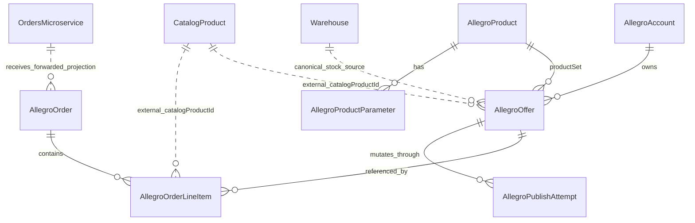

# Allegro Import/Export Mapping

Status: final mapping baseline before first controlled apply
Date: 2026-06-29
Scope: statexcz Allegro account, allegro-service, read/import/export mapping
Safety: no Chrome/browser control, no BizBox import, no Warehouse stock mutation, no stock apply

## Intent Preservation Chain

- Vision: make Allegro account data recoverable, importable, exportable, and explainable without losing the relation between checkout forms, line items, offers, products, stock, billing, and shipments.
- Goal Impact: enable a controlled importer/exporter path for statexcz while keeping Warehouse as stock owner and orders-microservice as central order owner.
- System: `allegro-service` under `/home/ssf/Documents/Github/allegro-service`, backed by Allegro REST API, Prisma/Postgres, Catalog, Warehouse, and orders-microservice clients.
- Feature: normalized Allegro data extraction and round-trip mapping.
- Task: document the final data mapping before any production apply run.
- Execution Plan: map official Allegro endpoints to local Prisma models, identify canonical fields and raw JSON retention, list unsafe paths, then run only guarded apply steps.
- Coding Prompt: create a durable mapping document first; do not run import/apply until the document exists and the safe entrypoint is explicit.
- Code: this document plus the existing implementation references listed below.
- Validation: repo inspected read-only; live dry-run evidence captured; production deploy already verified at image tag `1506cd1`; no stock/Warehouse mutation is authorized by this document.

## Source Evidence

Official Allegro contracts checked:

- REST method list: `https://developer.allegro.pl/tutorials/lista-metod-rest-api-allegro-yPyaj0wG3C4`
- Orders tutorial: `https://developer.allegro.pl/tutorials/jak-obslugiwac-zamowienia-GRaj0qyvwtR`
- Product-offer create/update tutorial: `https://developer.allegro.pl/tutorials/jak-jednym-requestem-wystawic-oferte-powiazana-z-produktem-D7Kj9gw4xFA`
- Offer management tutorial: `https://developer.allegro.pl/tutorials/jak-zarzadzac-ofertami-7GzB2L37ase`
- Billing tutorial: `https://developer.allegro.pl/tutorials/jak-sprawdzic-oplaty-nn9DOL5PASX`

Local source references:

- `prisma/schema.prisma`
- `prisma/migrations/20260629143000_normalize_allegro_checkout_forms/migration.sql`
- `services/allegro-service/src/allegro/allegro-api.service.ts`
- `services/allegro-service/src/allegro/orders/orders.service.ts`
- `services/allegro-service/src/allegro/orders/order-forwarding.mapper.ts`
- `services/allegro-service/src/allegro/offers/offers.service.ts`
- `services/allegro-service/src/allegro/publish-lifecycle/publish-lifecycle.service.ts`
- `services/allegro-service/src/scripts/import-order-offer-products.ts`
- `services/allegro-service/src/scripts/import-checkout-forms-local.ts`
- `scripts/harvest-order-offers.js`
- `shared/clients/order-client.service.ts`
- `shared/clients/warehouse-client.service.ts`
- `shared/rabbitmq/stock-events.subscriber.ts`
- `services/imports/src/import/import.service.ts`
- `services/imports/src/import/transformer/bizbox-to-allegro.service.ts`
- `services/api-gateway/src/gateway/gateway.controller.ts`

Live account evidence, without buyer PII:

- `GET /order/checkout-forms?limit=1&offset=0` returned `totalCount=117`.
- Full read-only order scan found `checkoutForms=117`, `lineItems=125`, `uniqueOfferIds=26`, `totalQuantity=131`.
- Multi-line checkout forms: `8`.
- Order status split: `READY_FOR_PROCESSING=103`, `CANCELLED=14`.
- Fulfillment split: `PICKED_UP=61`, `SENT=32`, `CANCELLED=22`, `RETURNED=2`.
- Marketplace split: `allegro-cz=116`, `allegro-sk=1`.
- Invoice requested: `3`.
- Post-deploy order-offer dry-run found `checkoutUniqueOffers=26`, `sourceQuality.order-line-item-only=23`, `sourceQuality.full-offer=3`, `errors=[]`, all write counters `0`.
- DB counts after dry-runs stayed `allegro_orders=0`, `allegro_order_line_items=0`, `allegro_offers=32`.

## Entity Relationship Map

Cardinality rules:

- One Allegro account has many offers.
- One Allegro checkout form maps to one local `AllegroOrder`.
- One `AllegroOrder` has `0..N` `AllegroOrderLineItem` rows.
- One line item points to one Allegro offer id from the checkout form; it may or may not have a local `AllegroOffer` row.
- `AllegroOrder.allegroOfferId` and `AllegroOrder.catalogProductId` are convenience primary/first-line links only. They are not canonical for multi-line checkout forms.
- One local `AllegroOffer` may be referenced by many historical order line items.
- `catalogProductId` is an external Catalog UUID reference. There is no local FK to catalog-microservice.
- Orders-microservice is the central order owner. Local `AllegroOrder` is a channel projection and evidence store.
- Warehouse is the stock owner. Allegro `stock.available` is a channel snapshot or target, not proof of physical stock.
- Any field named `quantity` must be interpreted by context: order and line item quantity is historical demand, offer quantity is sellable channel stock, Catalog marketplace override quantity is publish draft stock, and Warehouse event quantity is physical stock evidence.

## Official API Domains

### Orders

Canonical extraction:

- `GET /order/events`
- `GET /order/event-stats`
- `GET /order/checkout-forms`
- `GET /order/checkout-forms/{id}`

Local wrappers:

- `AllegroApiService.getOrders()` calls `/order/checkout-forms`.
- `AllegroApiService.getOrder(orderId)` calls `/order/checkout-forms/{id}`.
- `AllegroApiService.getOrderEvents(after, limit)` calls `/order/events?from=...&limit=...`, returning empty fallback when unavailable.
- Local read API: `GET /api/allegro/orders`, `GET /api/allegro/orders/:id`.

### Offers And Products

Canonical read:

- `GET /sale/offers` for listing accessible offers.
- `GET /sale/product-offers/{offerId}` for current full product-offer payload.
- `GET /sale/products` and `GET /sale/products/{productId}` for catalog products.
- `GET /sale/offer-events` for offer events.

Canonical write-back:

- `POST /sale/product-offers` for create.
- `PATCH /sale/product-offers/{offerId}` for update.
- `PUT /sale/offer-publication-commands/{commandId}` and `GET /sale/offer-publication-commands/{commandId}` for publication command lifecycle.
- Quantity changes should use the current command endpoint family `sale/offer-quantity-change-commands`. Local legacy `change-quantity-commands` usage is not approved for final stock apply.

Local wrappers and services:

- `AllegroApiService.getOfferWithOAuthToken()` calls `/sale/product-offers/{offerId}`.
- `AllegroApiService.createOfferWithOAuthToken()` calls `POST /sale/product-offers`.
- `AllegroApiService.updateOfferWithOAuthToken()` calls `PATCH /sale/product-offers/{offerId}`.
- `OffersService.importAllOffers()`, `importApprovedOffers()`, and Sales Center import paths persist offers and may sync Catalog/Warehouse.
- `PublishLifecycleService` owns governed prepare/confirm/execute write-back through `AllegroPublishAttempt`.

### Billing

Official endpoints:

- `GET /billing/billing-entries`
- `GET /billing/billing-types`

Local status:

- `[MISSING: billing client/module/schema]`
- `[UNKNOWN: exact local canonical billing field set]`

Mapping rule:

- Billing must not be inferred from order totals.
- First implementation should store full billing payload raw, then normalize amount, currency, type, occurred date, offer/order reference, and settlement reference after OpenAPI shape validation.

### Order Shipments And Fulfillment

Official order-level endpoints include:

- `GET /order/carriers`
- `GET /order/checkout-forms/{id}/shipments`
- `POST /order/checkout-forms/{id}/shipments`
- carrier points and tracking endpoints
- `PUT /order/checkout-forms/{id}/fulfillment`

Local status:

- Delivery method and address are stored inside `AllegroOrder`.
- Full shipment data is currently retained only inside `AllegroOrder.rawData` when present.
- `[MISSING: shipment/fulfillment client/module/schema]`

Mapping rule:

- One checkout form may have `0..N` shipment records and one mutable fulfillment status.
- Shipment creation, tracking writes, and fulfillment status writes are apply operations and require a separate guard.

### Shipment Management And One Fulfillment

Official shipment-management endpoints include delivery services, shipment create commands, command status, shipment details, pickups, labels, protocols, and cancel commands.

Official One Fulfillment endpoints include advance ship notices, labels, submit commands, fulfillment stock, fulfillment orders parcels, and available products.

Local status:

- `[MISSING: shipment-management implementation]`
- `[MISSING: One Fulfillment implementation]`

Mapping rule:

- Do not mix One Fulfillment stock, parcels, or ASN data with normal checkout-form fulfillment until a separate contract maps their cardinality and ownership.

## Local Storage Mapping

### AllegroAccount

Source: OAuth/account configuration.

Canonical fields:

- `id`, `userId`, `name`, `clientId`, encrypted `clientSecret`, encrypted `accessToken`, encrypted `refreshToken`, `tokenExpiresAt`, `tokenScopes`, `isActive`.

Rules:

- Active account must be selected before any user-specific read/write.
- No secret/token value may be logged or copied into docs.
- Offer/order writes must use an account matching `accountId`.

### AllegroOffer

Source:

- Full current offer: `/sale/product-offers/{offerId}`.
- Offer list: `/sale/offers`.
- Order recovery: checkout-form `lineItems[].offer` plus optional full offer fetch.

Canonical fields:

- `allegroOfferId`: external Allegro offer id.
- `accountId`: local owner account.
- `catalogProductId`: external Catalog product reference.
- `allegroProductId`: local raw productSet reference.
- `title`, `description`, `categoryId`, `price`, `currency`.
- `quantity`, `stockQuantity`: channel quantities only unless explicitly synced from Warehouse.
- `status`, `publicationStatus`.
- `deliveryOptions`, `paymentOptions`, `images`.
- `rawData`: full source payload and recovery evidence.
- `syncStatus`, `syncSource`, `syncError`, `lastSyncedAt`.
- `validationStatus`, `validationErrors`, `lastValidatedAt`.

Raw JSON rule:

- Store full `/sale/product-offers/{offerId}` response in `rawData` for round-trip fidelity.
- For order-only recovered offers, store `orderEvidence`, `orderStats`, and fetch errors in `rawData`, and mark source/recoverability as partial.

Unsafe semantic:

- Order-line-only offers do not provide current stock. `stockQuantity=0` for order-only recovered offers is a placeholder, not a physical stock statement.

### AllegroProduct And AllegroProductParameter

Source:

- Product data inside product-offer `productSet`.
- Direct `/sale/products/{productId}` where available.

Canonical fields:

- `AllegroProduct.allegroProductId`, `name`, `brand`, `manufacturerCode`, `ean`, `publicationStatus`, `rawData`.
- `AllegroProductParameter.parameterId`, `name`, `values`, `valuesIds`, `rangeValue`.

Rules:

- Normalize parameter rows for search/validation.
- Keep the original product/productSet JSON for export reconstruction.
- Product rows are not Catalog products; Catalog product identity is `catalogProductId`.

### AllegroOrder

Source:

- `GET /order/checkout-forms`
- `GET /order/checkout-forms/{id}`

Canonical aggregate fields:

- `allegroOrderId`: checkout form id.
- `buyerId`, `buyerEmail`, `buyerLogin`.
- `quantity`: aggregate sum of line quantities.
- `price`: first-line unit price for compatibility only.
- `totalPrice`: checkout form `summary.totalToPay`.
- `currency`: summary or line currency.
- `lineItemsCount`: count of checkout form line items.
- `status`, `paymentStatus`, `fulfillmentStatus`.
- `deliveryMethod`, `deliveryAddress`, `trackingNumber`.
- `paymentMethod`, `paidAt`.
- `marketplaceId`, `revision`, `invoiceRequired`.
- `orderDate`: `createdAt`, fallback first line `boughtAt`, fallback `updatedAt`.
- `rawData`: full checkout-form payload.

Rules:

- Do not use aggregate `allegroOfferId`/`catalogProductId` as canonical for the order's products.
- Buyer/payment fields are sensitive and must not be printed in logs/docs.
- `rawData` contains production/customer data and must be treated as private.
- `quantity` here is ordered aggregate quantity, not sellable stock.

### AllegroOrderLineItem

Source:

- checkout form `lineItems[]`.

Canonical line fields:

- `orderId`: local `AllegroOrder.id`.
- `allegroLineItemId`: line item id or deterministic fallback.
- `allegroOfferExternalId`: checkout form `lineItems[].offer.id`.
- `allegroOfferId`: local `AllegroOffer.id`, nullable.
- `catalogProductId`: external Catalog UUID, nullable.
- `title`, `quantity`, `price`, `originalPrice`, `totalPrice`, `currency`.
- `tax`, `discounts`, `vouchers`, `selectedAdditionalServices`.
- `boughtAt`, `rawData`.

Rules:

- Unique key is `(orderId, allegroLineItemId)`.
- Every line item should be individually mapped before forwarding to orders-microservice.
- Missing local offer or Catalog mapping blocks central order forwarding.
- `quantity` here is ordered line quantity, not sellable stock.

### AllegroPublishAttempt

Source:

- Governed write-back lifecycle.

Canonical fields:

- `action`: `PUBLISH`, `UPDATE`, `END`.
- `status`: `PREPARED`, `BLOCKED`, `CONFIRMED`, `QUEUED`, `RUNNING`, `SUCCEEDED`, `FAILED`, `CANCELLED`, `STALE`.
- `idempotencyKey`, `requestedByUserId`, `accountId`, `catalogProductId`, `offerId`, `allegroOfferId`, `commandId`.
- `commandPayload`, `policySnapshot`, `blockedReasons`, `failureContext`, `remediationContext`.

Rules:

- All offer create/update export-back operations must go through this lifecycle.
- Direct legacy publish/update endpoints are not the approved final path.

## Import Flows

### Gateway And Frontend Boundaries

- `services/api-gateway/src/gateway/gateway.controller.ts` proxies `/api/allegro/*` to allegro-service and `/api/import/*` to imports-service.
- `services/frontend/src/services/api.ts` is a thin API consumer and is not the mapping authority.
- `services/allegro-service/src/allegro/products/products.service.ts` is Catalog-first for product views; marketplace overrides may contain draft quantity, but this is not historical order quantity.
- `services/allegro-service/src/allegro/catalog-sell-action/catalog-sell-action.service.ts` can create local publish drafts from Catalog and marketplace overrides; draft stock must be treated as a publish input, not order evidence.

### Read-Only Checkout Form Extraction

Purpose:

- Understand historical orders and line item to offer relationships.

Safe operations:

- `GET /order/checkout-forms`
- `GET /order/checkout-forms/{id}`
- No DB writes.
- No Catalog writes.
- No Warehouse writes.
- No central order forwarding.

Validated evidence:

- `statexcz` dry-run returned 117 checkout forms, 125 line items, and 26 unique offer ids.

### Local Checkout Form Projection

Purpose:

- Persist `AllegroOrder` and `AllegroOrderLineItem` as local channel evidence.

Desired safe behavior:

- Upsert checkout forms into `allegro_orders`.
- Delete/recreate each order's local line item projection from the latest checkout-form payload.
- Resolve local offer/catalog mapping where available.
- Do not forward to orders-microservice in the first projection apply.
- Do not touch Catalog.
- Do not touch Warehouse.
- Do not touch Allegro write endpoints.

Current repo status:

- `OrdersService.syncOrdersFromAllegro()` persists local orders and line items.
- It also attempts to forward to orders-microservice when every line item is mapped.
- `services/allegro-service/src/scripts/import-checkout-forms-local.ts` is the guarded local-only entrypoint for the first production apply.

Launch gate:

- Use only `node dist/scripts/import-checkout-forms-local.js --account-name statexcz --apply --confirm-local-only` for the first controlled projection apply.
- Do not run existing `syncOrdersFromAllegro()` in production as the first controlled apply because it can forward mapped orders to orders-microservice.

### Order-Derived Offer/Product Recovery

Current script:

- `services/allegro-service/src/scripts/import-order-offer-products.ts`

Default behavior:

- `--dry-run` is default.
- Reads checkout forms.
- For each unique line-offer id, tries:
  - checkout form detail evidence.
  - `/sale/product-offers/{offerId}`.
  - `/sale/product-offers/{offerId}/parts`.
  - legacy `/sale/offers/{offerId}` only as evidence; it is blocked/unsupported for old integrations.
  - optional `/sale/products` catalog search unless `--no-catalog-search`.

Apply behavior:

- Creates/updates Catalog products.
- Syncs Catalog media.
- Syncs Catalog pricing.
- Writes Allegro marketplace profile.
- Upserts local `AllegroOffer`.

Safety:

- This is not an order import.
- This is not a Warehouse stock import.
- It must not be run with `--apply` for order-line-only offers until placeholder stock semantics are reviewed.

### Sales Center Offer Import

Routes:

- `GET /api/allegro/offers/import/preview`
- `POST /api/allegro/offers/import/approve`
- `GET /api/allegro/offers/import/sales-center/preview`
- `POST /api/allegro/offers/import/sales-center/approve`
- `POST /api/allegro/offers/import/sales-center`

Behavior:

- Imports full offers.
- Syncs Catalog.
- `OffersService.syncWarehouseStockFromImportedOffer()` can call Warehouse `setStock`.

Safety:

- Not allowed in this order mapping apply.
- Requires explicit coordination with Warehouse stock owner before use.

### BizBox CSV Import

Known safe/unsafe split:

- Preview path: `POST /api/import/csv/preview`.
- Apply path: `POST /api/import/csv` with confirmation header and preview token.

Safety:

- Out of scope for Allegro account structure mapping.
- Do not run BizBox/current stock import from this thread.
- BizBox category mapping is currently placeholder/incomplete; any apply run that depends on BizBox-to-Allegro category IDs is not ready until category mapping is explicit.

## Export-Back Mapping

### Offer Create

Approved path:

- `PublishLifecycleService.prepare()`
- `confirm()`
- `execute()`
- `OffersService.publishOffersToAllegro()`
- `AllegroApiService.createOfferWithOAuthToken()`
- `POST /sale/product-offers`

Required canonical inputs:

- Active OAuth account.
- `catalogProductId`.
- Product/category/parameters/productSet.
- Responsible producer.
- Title/name.
- Price/currency.
- Stock target, but only from Warehouse-approved stock contract.
- Images with public URLs.
- Delivery/payment/location policy.

### Offer Update

Approved path:

- `PublishLifecycleService.prepare()`
- `confirm()`
- `execute()`
- `OffersService.syncOfferUpdateToAllegroTerminal()`
- `AllegroApiService.updateOfferWithOAuthToken()`
- `PATCH /sale/product-offers/{offerId}`

Repo evidence:

- Current update payload includes `name`, `category`, `sellingMode.price`, `stock.available`, and `productSet`.
- Current code avoids description/images in PATCH because local evidence says Allegro rejects those fields on product-offer PATCH.

### Stock Update

Current unsafe local path:

- `PUT /api/allegro/offers/:id/stock`
- `OffersService.updateOfferStock()`
- DB is updated first.
- Allegro API call happens asynchronously.
- Wrapper uses legacy `/sale/offers/{offerId}/change-quantity-commands`.

Final mapping decision:

- This path is not approved for stock apply.
- Stock write-back must be based on Warehouse canonical available stock, durable attempt storage, idempotency key, one-request-per-second account rate limit, current quantity command endpoint, command status polling, and terminal-state recording.
- `shared/rabbitmq/stock-events.subscriber.ts` updates local `AllegroOffer.quantity`/`stockQuantity` from Warehouse `stock.updated` and `stock.out` events, but it does not sync those changes to Allegro API yet.
- `shared/clients/warehouse-client.service.ts` exposes `getTotalAvailable()`, `setStock()`, `reserveStock()`, `unreserveStock()`, and `decrementStock()`; current full-offer imports use `setStock()`, which is forbidden for this first apply.

## Safety Gates Before Any Apply

Global gates:

- Remote repo clean-state captured.
- Target commit captured.
- Dry-run summary captured.
- Before/after DB counts captured.
- Logs checked for stock/import/write activity.
- No buyer PII printed.
- Rollback plan or DB snapshot identified for write runs.

Account gates:

- OAuth access token exists and is refreshable.
- Active account selected.
- Offer `accountId` matches active account.
- Scopes confirmed for endpoint family.

Order gates:

- Use local-only checkout form projection for first order apply.
- No forwarding to orders-microservice unless every line has `catalogProductId` and replay identity is confirmed.
- Idempotency identity for central forwarding is `channel=allegro + channelAccountId + externalOrderId`.
- Duplicate central order is accepted only when payload equality is confirmed.

Offer/product gates:

- ProductSet/category/parameters validated.
- Responsible producer present.
- Images are valid public URLs before create.
- PATCH must not include fields Allegro rejects.
- Partial/order-only recovered offers remain marked partial.

Stock gates:

- Warehouse is canonical.
- Order quantity is historical demand, not available stock.
- Allegro `stock.available` is current channel snapshot only when read from full product-offer payload.
- No direct DB-first async stock update.
- No Warehouse `setStock` from Sales Center import unless explicitly coordinated.
- Stock-out requires manual review unless the approved stock policy says otherwise.

Billing/shipping gates:

- Billing is read-only until schema/client exists.
- Shipments are read-only until schema/client exists.
- No refunds, invoice uploads, shipment creation, fulfillment status writes, labels, pickup, cancel, ASN, or One Fulfillment commands in the first apply.

## First Controlled Launch Plan

Allowed first launch:

- Persist local checkout forms and line items only.
- Target tables: `allegro_orders`, `allegro_order_line_items`.
- Allowed source: `GET /order/checkout-forms`, `GET /order/checkout-forms/{id}`.
- Allowed DB changes: upsert local order projection and replace local line-item projection for those orders.

Forbidden in first launch:

- Catalog product writes.
- Local offer recovery apply.
- Warehouse stock writes.
- BizBox/current stock imports.
- Allegro offer create/update/stock writes.
- Orders-microservice forwarding.
- Billing/shipping/fulfillment writes.

Required implementation before first launch:

- Use `services/allegro-service/src/scripts/import-checkout-forms-local.ts`.
- Default to dry-run.
- Require `--apply --confirm-local-only` for persistence.
- Print aggregate stats only.
- Avoid logging buyer emails, addresses, tokens, or raw checkout form payloads.
- Capture before/after counts.

## Parallel Execution Notes

- Integration owner: original Allegro account/data-structure thread.
- Validation owner: same thread, unless a separate integration-validator is started.
- Ready now: build guarded local-only checkout form importer.
- Dependency-gated: export-back to Allegro offers, stock sync, shipment creation, billing normalization.
- Blocked: Warehouse-backed stock mutation without stock orchestration approval.
- Shared files/contracts: `prisma/schema.prisma`, order sync code, publish lifecycle, stock contract.
- Merge order for future work: docs/runbook first, safe order importer second, export-back mapping tests third, stock sync contract last.

## Current Decision

The data model is ready to represent checkout forms, order line items, current offers, partial historical offers, and governed publish attempts.

The first production apply must not use the current generic order sync path as-is, because it can forward mapped orders to orders-microservice. The first production apply must use a local-only checkout form importer or an explicit no-forward guard.

Next step: implement and run the guarded local-only checkout form import, then validate counts and logs.
