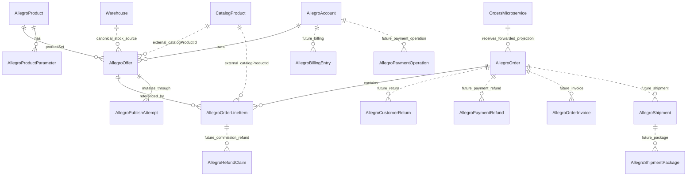

# Allegro Import/Export Mapping

Status: final mapping baseline after first local order projection apply and second read-only domain pass
Date: 2026-06-29
Scope: statexcz Allegro account, allegro-service, read/import/export mapping
Safety: no Chrome/browser control, no BizBox import, no Warehouse stock mutation, no stock apply
Implementation plan: `docs/orchestrator/ALLEGRO_PRIMARY_CHANNEL_IMPLEMENTATION_PLAN.md`

## Intent Preservation Chain

- Vision: make Allegro account data recoverable, importable, exportable, and explainable without losing the relation between checkout forms, line items, offers, products, stock, billing, and shipments.
- Goal Impact: enable a controlled importer/exporter path for statexcz while keeping Warehouse as stock owner and orders-microservice as central order owner.
- System: `allegro-service` under `/home/ssf/Documents/Github/allegro-service`, backed by Allegro REST API, Prisma/Postgres, Catalog, Warehouse, and orders-microservice clients.
- Feature: normalized Allegro data extraction and round-trip mapping.
- Task: document the final data mapping and remaining domain gaps after the controlled local order projection apply.
- Execution Plan: map official Allegro endpoints to local Prisma models, identify canonical fields and raw JSON retention, list unsafe paths, and keep second-pass domains read-only until schema/client contracts exist.
- Coding Prompt: keep this document as the import/export contract; only local order projection was applied, while billing, shipments, returns, invoices, stock, and write-back mutation paths remain guarded.
- Code: this document plus the existing implementation references listed below.
- Validation: repo inspected read-only at `10009cb`; first projection created 117 local orders and 125 local line items earlier; production order UI/API was verified on `f95fb3f`; no stock/Warehouse/BizBox/Allegro write mutation is authorized by this document.

## Source Evidence

Official Allegro contracts checked:

- REST method list: `https://developer.allegro.pl/tutorials/lista-metod-rest-api-allegro-yPyaj0wG3C4`
- Orders tutorial: `https://developer.allegro.pl/tutorials/jak-obslugiwac-zamowienia-GRaj0qyvwtR`
- Product-offer create/update tutorial: `https://developer.allegro.pl/tutorials/jak-jednym-requestem-wystawic-oferte-powiazana-z-produktem-D7Kj9gw4xFA`
- Offer management tutorial: `https://developer.allegro.pl/tutorials/jak-zarzadzac-ofertami-7GzB2L37ase`
- Billing tutorial: `https://developer.allegro.pl/tutorials/jak-sprawdzic-oplaty-nn9DOL5PASX`
- Payments and refunds tutorial section: `https://developer.allegro.pl/tutorials/jak-obslugiwac-zamowienia-GRaj0qyvwtR`
- Ship with Allegro tutorial: `https://developer.allegro.pl/tutorials/how-to-manage-parcels-via-ship-with-allegro-ZM9YAyGKWTV`
- One Fulfillment tutorial: `https://developer.allegro.pl/tutorials/one-fulfillment-by-allegro-4R9dXyMPlc9`
- Current OpenAPI spec checked from `https://developer.allegro.pl/swagger.yaml`

Local source references:

- `prisma/schema.prisma`
- `prisma/migrations/20260629143000_normalize_allegro_checkout_forms/migration.sql`
- `services/allegro-service/src/allegro/allegro-api.service.ts`
- `services/allegro-service/src/allegro/orders/orders.service.ts`
- `services/allegro-service/src/allegro/orders/order-forwarding.mapper.ts`
- `services/allegro-service/src/allegro/offers/offers.service.ts`
- `services/allegro-service/src/allegro/publish-lifecycle/publish-lifecycle.service.ts`
- `services/allegro-service/src/allegro/catalog-sell-action/catalog-sell-action.service.ts`
- `services/allegro-service/src/scripts/import-order-offer-products.ts`
- `services/allegro-service/src/scripts/import-checkout-forms-local.ts`
- `services/allegro-service/src/allegro/stock-order-profit-loop/stock-order-profit-loop.contract.ts`
- `scripts/harvest-order-offers.js`
- `shared/clients/order-client.service.ts`
- `shared/clients/warehouse-client.service.ts`
- `shared/rabbitmq/stock-events.subscriber.ts`
- `services/imports/src/import/import.service.ts`
- `services/imports/src/import/transformer/bizbox-to-allegro.service.ts`
- `services/api-gateway/src/gateway/gateway.controller.ts`

Live account evidence, without buyer PII:

- `GET /order/checkout-forms?limit=1&offset=0` returned `totalCount=117`.
- Full read-only order scan found `checkoutForms=117`, `lineItems=125`, `uniqueOfferIds=26`, `totalQuantity=131`.
- Multi-line checkout forms: `8`.
- Order status split: `READY_FOR_PROCESSING=103`, `CANCELLED=14`.
- Fulfillment split: `PICKED_UP=61`, `SENT=32`, `CANCELLED=22`, `RETURNED=2`.
- Marketplace split: `allegro-cz=116`, `allegro-sk=1`.
- Invoice requested: `3`.
- Post-deploy order-offer dry-run found `checkoutUniqueOffers=26`, `sourceQuality.order-line-item-only=23`, `sourceQuality.full-offer=3`, `errors=[]`, all write counters `0`.
- First guarded local-only apply later created `allegro_orders=117` and `allegro_order_line_items=125`; `allegro_offers=32`; unmapped line items after apply: `0`.
- Verified API/UI after apply: `GET /api/allegro/orders?page=1&limit=25` returned `total=117`, `totalPages=5`; page 5 returned `items=17`; `/dashboard/orders` returned HTTP 200.
- Current repo head during second pass: `10009cb fix: cap Allegro draft stock to Warehouse availability`.
- Current deploy evidence for the order UI/API verification was `f95fb3f`; this docs-only update does not require deploy.

## Second-Pass Domain Status Matrix

| Domain | Official read surface | Local status | Write/export status |
| --- | --- | --- | --- |
| Checkout forms/orders | `/order/checkout-forms`, `/order/events` | Implemented local projection: `AllegroOrder`, `AllegroOrderLineItem` | Central forwarding remains guarded; generic sync can forward and is not the replay path |
| Offers/products | `/sale/offers`, `/sale/product-offers/{id}`, `/sale/products`, category endpoints | Implemented current/partial offer/product projection | Create/update only through publish lifecycle; stock writes blocked |
| Billing entries/types | `/billing/billing-entries`, `/billing/billing-types` | `[MISSING: local schema/client]` | Read-only until billing contract exists |
| Payment operations | `/payments/payment-operations` | `[MISSING: local schema/client]` | Refunds/payment writes blocked |
| Returns | `/order/customer-returns` | `[MISSING: local schema/client]` | Return rejection blocked |
| Payment refunds | `GET /payments/refunds` | `[MISSING: local schema/client]` | `POST /payments/refunds` blocked |
| Commission refund claims | `/order/refund-claims` | `[MISSING: local schema/client]` | create/delete claims blocked |
| Invoices/billing documents | `/order/checkout-forms/{id}/invoices` | only `invoiceRequired` and `rawData` today | invoice metadata/file/link writes blocked |
| Sale issues/claims | `/sale/issues` | `[MISSING: local schema/client]` | issue message/status mutations blocked |
| Order shipments/tracking | `/order/checkout-forms/{id}/shipments`, `/order/carriers` | only delivery fields and nullable `trackingNumber`; no durable shipment table | tracking write and fulfillment status write blocked |
| Shipment management | `/shipment-management/*` | `[MISSING: local schema/client]` | create/cancel/label/protocol/pickup blocked |
| One Fulfillment | `/fulfillment/*` | `[MISSING: local schema/client]` | ASN writes and One Fulfillment commands blocked |
| Warehouse-backed stock | Warehouse API plus Allegro offer quantity commands | draft quantity capped to Warehouse availability at `10009cb`; no durable Allegro stock sync | blocked pending stock orchestration approval |

## Entity Relationship Map

Cardinality rules:

- One Allegro account has many offers.
- One Allegro checkout form maps to one local `AllegroOrder`.
- One `AllegroOrder` has `0..N` `AllegroOrderLineItem` rows.
- One line item points to one Allegro offer id from the checkout form; it may or may not have a local `AllegroOffer` row.
- `AllegroOrder.allegroOfferId` and `AllegroOrder.catalogProductId` are convenience primary/first-line links only. They are not canonical for multi-line checkout forms.
- One local `AllegroOffer` may be referenced by many historical order line items.
- `catalogProductId` is an external Catalog UUID reference. There is no local FK to catalog-microservice.
- Orders-microservice is the central order owner. Local `AllegroOrder` is a channel projection and evidence store.
- Warehouse is the stock owner. Allegro `stock.available` is a channel snapshot or target, not proof of physical stock.
- Any field named `quantity` must be interpreted by context: order and line item quantity is historical demand, offer quantity is sellable channel stock, Catalog marketplace override quantity is publish draft stock, and Warehouse event quantity is physical stock evidence.
- Customer returns, payment refunds, commission refund claims, invoices, billing entries, payment operations, shipments, and One Fulfillment records are not implemented as first-class local models yet. They are future projections marked in the ER map with dotted relations.
- Cancellation is initially order status evidence (`checkoutForm.status=CANCELLED`) plus related payment/refund evidence; it is not a local write workflow.
- One Fulfillment is a parallel provider-managed path when `checkoutForm.fulfillment.provider.id=ALLEGRO`; do not merge it into seller-managed shipment logic without a separate contract.

## Official API Domains

### Orders

Canonical extraction:

- `GET /order/events`
- `GET /order/event-stats`
- `GET /order/checkout-forms`
- `GET /order/checkout-forms/{id}`

Local wrappers:

- `AllegroApiService.getOrders()` calls `/order/checkout-forms`.
- `AllegroApiService.getOrder(orderId)` calls `/order/checkout-forms/{id}`.
- `AllegroApiService.getOrderEvents(after, limit)` calls `/order/events?from=...&limit=...`, returning empty fallback when unavailable.
- Local read API: `GET /api/allegro/orders`, `GET /api/allegro/orders/:id`.

### Offers And Products

Canonical read:

- `GET /sale/offers` for listing accessible offers.
- `GET /sale/product-offers/{offerId}` for current full product-offer payload.
- `GET /sale/products` and `GET /sale/products/{productId}` for catalog products.
- `GET /sale/categories`, `GET /sale/categories/{categoryId}`, and `GET /sale/categories/{categoryId}/parameters` for category and parameter validation.
- `GET /sale/offer-events` for offer events.

Canonical write-back:

- `POST /sale/product-offers` for create.
- `PATCH /sale/product-offers/{offerId}` for update.
- `POST /sale/images` for image upload/import support before create.
- `PUT /sale/offer-publication-commands/{commandId}` and `GET /sale/offer-publication-commands/{commandId}` for publication command lifecycle.
- `PUT /sale/offer-quantity-change-commands/{commandId}`, `GET /sale/offer-quantity-change-commands/{commandId}`, and `GET /sale/offer-quantity-change-commands/{commandId}/tasks` for quantity command lifecycle.
- `PUT /sale/offer-price-change-commands/{commandId}` and related status/tasks endpoints for price command lifecycle.
- Local legacy `change-quantity-commands` usage is not approved for final stock apply.

Local wrappers and services:

- `AllegroApiService.getOfferWithOAuthToken()` calls `/sale/product-offers/{offerId}`.
- `AllegroApiService.createOfferWithOAuthToken()` calls `POST /sale/product-offers`.
- `AllegroApiService.updateOfferWithOAuthToken()` calls `PATCH /sale/product-offers/{offerId}`.
- `OffersService.importAllOffers()`, `importApprovedOffers()`, and Sales Center import paths persist offers and may sync Catalog/Warehouse.
- `PublishLifecycleService` owns governed prepare/confirm/execute write-back through `AllegroPublishAttempt`.

### Billing

Official endpoints:

- `GET /billing/billing-entries`
- `GET /billing/billing-types`
- `GET /payments/payment-operations`
- `POST /pricing/offer-fee-preview`
- `GET /pricing/offer-quotes`

Local status:

- `[MISSING: billing client/module/schema]`
- `[MISSING: payment operations model/client and payments-microservice runtime client]`
- `[MISSING: normalized payment.id, paidAmount, payment.reconciliation, delivery.cost columns]`
- `[UNKNOWN: current OAuth scopes/tokens available in production for billing/payment endpoints]`

Mapping rule:

- Billing must not be inferred from order totals.
- `BillingEntry.order.id` should join to `AllegroOrder.allegroOrderId` when present.
- `BillingEntry.offer.id` should join to `AllegroOffer.allegroOfferId` and/or `AllegroOrderLineItem.allegroOfferExternalId`.
- `BillingEntry.type.id` should join to cached `BillingType.id`.
- `PaymentOperation.payment.id` should join to checkout-form `rawData.payment.id` until a normalized payment column exists.
- Fee preview is expected-fee evidence for pre-publish decisions only; actual fees/settlements must come from billing entries and payment operations.
- First implementation should store full billing/payment payload raw, then normalize amount, currency, type, occurred date, marketplace, offer/order/payment references, wallet/group, and settlement reference after OpenAPI shape validation.

### Returns, Refunds, Claims, Invoices, Issues

Official read endpoints:

- `GET /order/customer-returns`
- `GET /order/customer-returns/{customerReturnId}`
- `GET /payments/refunds`
- `GET /order/refund-claims`
- `GET /order/refund-claims/{claimId}`
- `GET /order/checkout-forms/{id}/invoices`
- `GET /sale/issues`
- `GET /sale/issues/{issueId}`

Official write endpoints, blocked until owner approval:

- `POST /payments/refunds`
- `POST /order/customer-returns/{customerReturnId}/rejection`
- `POST /order/refund-claims`
- `DELETE /order/refund-claims/{claimId}`
- `POST /order/checkout-forms/{id}/invoices`
- `PUT /order/checkout-forms/{id}/invoices/{invoiceId}/file`
- `POST /order/{orderId}/billing-documents/links`
- issue chat/message/attachment/status mutation endpoints

Local status:

- `[MISSING: local Prisma models for returns, payment refunds, refund claims, sale issues, cancellations, invoices, billing entries]`
- `[MISSING: local controllers/services/API wrappers for customer returns, payments/refunds, refund-claims, sale/issues, invoices, billing entries]`
- `AllegroOrder.invoiceRequired` and `AllegroOrder.rawData` are the only current invoice evidence fields.

Mapping rule:

- `CustomerReturn` should relate to `AllegroOrder.allegroOrderId` through return `orderId`; returned items should join by item offer id plus quantity until Allegro line item identity is confirmed.
- `PaymentRefund` should relate to checkout-form `payment.id`, optional `order.id`, and refunded line item ids when present.
- `CommissionRefundClaim` should relate directly to `AllegroOrderLineItem.allegroLineItemId`.
- `Invoice/BillingDocument` should be a child record of `AllegroOrder`; file upload and link creation are write operations.
- Sale issues/reclamations should be stored as support evidence, not as order status, until a support owner approves workflow semantics.
- `[UNKNOWN: exact customer return item to local line item mapping when Allegro return item exposes offer id but not checkout lineItem.id]`

### Order Shipments And Fulfillment

Official order-level endpoints include:

- `GET /order/carriers`
- `GET /order/carriers/{carrierId}/tracking`
- `GET /order/checkout-forms/{id}/shipments`
- `POST /order/checkout-forms/{id}/shipments`
- carrier points and tracking endpoints
- `PUT /order/checkout-forms/{id}/fulfillment`

Local status:

- Delivery method and address are stored inside `AllegroOrder`.
- One nullable `AllegroOrder.trackingNumber` exists, but it is not a durable multi-shipment model.
- Full shipment data is currently retained only inside `AllegroOrder.rawData` when present; the local-only importer currently writes `trackingNumber: null`.
- `[MISSING: shipment/fulfillment client/module/schema]`
- `[MISSING: durable shipmentId/package/label/protocol tables]`
- `[MISSING: deterministic shipping-cost source for margin/profit]`

Mapping rule:

- One checkout form may have `0..N` waybill/shipment records and one mutable fulfillment status.
- A shipment may have `0..N` packages/parcels; package waybills are not equivalent to line item ids.
- Carrier tracking history joins by `carrierId + waybill`, not by checkout form alone.
- `PUT /order/checkout-forms/{id}/fulfillment` requires the checkout form id and should use the current revision when available; seller cannot set every enum value, including `RETURNED`.
- Shipment creation, tracking writes, and fulfillment status writes are apply operations and require a separate guard.
- `[UNKNOWN: seller setting for automatic SENT after tracking number]`

### Shipment Management And One Fulfillment

Official shipment-management endpoints include:

- `GET /shipment-management/delivery-proposals/{orderId}`
- `GET /shipment-management/delivery-services` (deprecated and planned for removal in Q1 2027)
- `POST /shipment-management/shipments/create-commands`
- `GET /shipment-management/shipments/create-commands/{commandId}`
- `GET /shipment-management/shipments/{shipmentId}`
- `POST /shipment-management/label`
- `POST /shipment-management/protocol`
- `POST /shipment-management/shipments/cancel-commands`
- `GET /shipment-management/shipments/cancel-commands/{commandId}`
- pickup proposal/create/detail endpoints

Official One Fulfillment endpoints include:

- `GET /fulfillment/advance-ship-notices`
- `POST /fulfillment/advance-ship-notices`
- `GET /fulfillment/advance-ship-notices/{id}`
- ASN update/delete/cancel/submit endpoints
- `GET /fulfillment/advance-ship-notices/{id}/labels`
- `GET /fulfillment/advance-ship-notices/{id}/receiving-state`
- `GET /fulfillment/orders/{orderId}/parcels`
- `GET /fulfillment/stock`
- `GET /fulfillment/available-products`
- `GET /fulfillment/returns/refund-dispositions`

Local status:

- `[MISSING: shipment-management implementation]`
- `[MISSING: One Fulfillment implementation]`
- `[UNKNOWN: current production token scopes/accounts for shipment and fulfillment read endpoints]`

Mapping rule:

- `delivery-proposals` can seed shipment creation, but shipment creation remains a write command.
- Shipment create/cancel commands must store `commandId`, command input, command output/status, retry-after, terminal state, and any `shipmentId` before labels/protocols are requested.
- Labels/protocols are binary document retrieval operations and need storage/redaction policy before use.
- Do not mix One Fulfillment stock, parcels, refund dispositions, or ASN data with normal checkout-form fulfillment until a separate contract maps their cardinality and ownership.
- One Fulfillment stock is Allegro warehouse stock, not Alfares Warehouse canonical stock.
- `[UNKNOWN: whether shipment-management create always registers an order waybill in all carrier paths]`

## Local Storage Mapping

### AllegroAccount

Source: OAuth/account configuration.

Canonical fields:

- `id`, `userId`, `name`, `clientId`, encrypted `clientSecret`, encrypted `accessToken`, encrypted `refreshToken`, `tokenExpiresAt`, `tokenScopes`, `isActive`.

Rules:

- Active account must be selected before any user-specific read/write.
- No secret/token value may be logged or copied into docs.
- Offer/order writes must use an account matching `accountId`.

### AllegroOffer

Source:

- Full current offer: `/sale/product-offers/{offerId}`.
- Offer list: `/sale/offers`.
- Order recovery: checkout-form `lineItems[].offer` plus optional full offer fetch.

Canonical fields:

- `allegroOfferId`: external Allegro offer id.
- `accountId`: local owner account.
- `catalogProductId`: external Catalog product reference.
- `allegroProductId`: local raw productSet reference.
- `title`, `description`, `categoryId`, `price`, `currency`.
- `quantity`, `stockQuantity`: channel quantities only unless explicitly synced from Warehouse.
- `status`, `publicationStatus`.
- `deliveryOptions`, `paymentOptions`, `images`.
- `rawData`: full source payload and recovery evidence.
- `syncStatus`, `syncSource`, `syncError`, `lastSyncedAt`.
- `validationStatus`, `validationErrors`, `lastValidatedAt`.

Raw JSON rule:

- Store full `/sale/product-offers/{offerId}` response in `rawData` for round-trip fidelity.
- For order-only recovered offers, store `orderEvidence`, `orderStats`, and fetch errors in `rawData`, and mark source/recoverability as partial.

Unsafe semantic:

- Order-line-only offers do not provide current stock. `stockQuantity=0` for order-only recovered offers is a placeholder, not a physical stock statement.

### AllegroProduct And AllegroProductParameter

Source:

- Product data inside product-offer `productSet`.
- Direct `/sale/products/{productId}` where available.

Canonical fields:

- `AllegroProduct.allegroProductId`, `name`, `brand`, `manufacturerCode`, `ean`, `publicationStatus`, `rawData`.
- `AllegroProductParameter.parameterId`, `name`, `values`, `valuesIds`, `rangeValue`.

Rules:

- Normalize parameter rows for search/validation.
- Keep the original product/productSet JSON for export reconstruction.
- Product rows are not Catalog products; Catalog product identity is `catalogProductId`.

### AllegroOrder

Source:

- `GET /order/checkout-forms`
- `GET /order/checkout-forms/{id}`

Canonical aggregate fields:

- `allegroOrderId`: checkout form id.
- `buyerId`, `buyerEmail`, `buyerLogin`.
- `quantity`: aggregate sum of line quantities.
- `price`: first-line unit price for compatibility only.
- `totalPrice`: checkout form `summary.totalToPay`.
- `currency`: summary or line currency.
- `lineItemsCount`: count of checkout form line items.
- `status`, `paymentStatus`, `fulfillmentStatus`.
- `deliveryMethod`, `deliveryAddress`, `trackingNumber`.
- `paymentMethod`, `paidAt`.
- `marketplaceId`, `revision`, `invoiceRequired`.
- `orderDate`: `createdAt`, fallback first line `boughtAt`, fallback `updatedAt`.
- `rawData`: full checkout-form payload.

Rules:

- Do not use aggregate `allegroOfferId`/`catalogProductId` as canonical for the order's products.
- Buyer/payment fields are sensitive and must not be printed in logs/docs.
- `rawData` contains production/customer data and must be treated as private.
- `quantity` here is ordered aggregate quantity, not sellable stock.

### AllegroOrderLineItem

Source:

- checkout form `lineItems[]`.

Canonical line fields:

- `orderId`: local `AllegroOrder.id`.
- `allegroLineItemId`: line item id or deterministic fallback.
- `allegroOfferExternalId`: checkout form `lineItems[].offer.id`.
- `allegroOfferId`: local `AllegroOffer.id`, nullable.
- `catalogProductId`: external Catalog UUID, nullable.
- `title`, `quantity`, `price`, `originalPrice`, `totalPrice`, `currency`.
- `tax`, `discounts`, `vouchers`, `selectedAdditionalServices`.
- `boughtAt`, `rawData`.

Rules:

- Unique key is `(orderId, allegroLineItemId)`.
- Every line item should be individually mapped before forwarding to orders-microservice.
- Missing local offer or Catalog mapping blocks central order forwarding.
- `quantity` here is ordered line quantity, not sellable stock.

### AllegroPublishAttempt

Source:

- Governed write-back lifecycle.

Canonical fields:

- `action`: `PUBLISH`, `UPDATE`, `END`.
- `status`: `PREPARED`, `BLOCKED`, `CONFIRMED`, `QUEUED`, `RUNNING`, `SUCCEEDED`, `FAILED`, `CANCELLED`, `STALE`.
- `idempotencyKey`, `requestedByUserId`, `accountId`, `catalogProductId`, `offerId`, `allegroOfferId`, `commandId`.
- `commandPayload`, `policySnapshot`, `blockedReasons`, `failureContext`, `remediationContext`.

Rules:

- All offer create/update export-back operations must go through this lifecycle.
- Direct legacy publish/update endpoints are not the approved final path.
- `END` is declared as an action but final execution is not fully implemented for non-`PUBLISH`/`UPDATE` actions; treat it as `[MISSING: PublishLifecycle END execution]`.

### Future Projection Models

These entities are official Allegro domains but are not implemented as first-class local models yet. They must be added before any apply/write workflow in their domain:

- `AllegroBillingType`: `typeId`, localized name, raw payload, cache timestamp.
- `AllegroBillingEntry`: `billingEntryId`, `accountId`, `marketplaceId`, `occurredAt`, `typeId`, signed amount/currency, tax, balance, `orderExternalId`, `offerExternalId`, raw payload.
- `AllegroPaymentOperation`: operation id, wallet/group/type/operator, `paymentId`, participant redacted fields, value/currency, occurred date, marketplace, raw payload.
- `AllegroCustomerReturn`: `customerReturnId`, `orderExternalId`, status, marketplace, return item summary, parcels/waybills redacted, raw payload.
- `AllegroPaymentRefund`: refund id/command id, `paymentId`, `orderExternalId`, refunded line item ids where present, amount/currency, status, reason, raw payload.
- `AllegroRefundClaim`: claim id, `allegroLineItemId`, status, quantity, buyer/offer references, raw payload.
- `AllegroOrderInvoice`: invoice id, `orderExternalId`, status, antivirus/EPT verification metadata, file metadata only, raw payload.
- `AllegroSaleIssue`: issue id, `orderExternalId`/offer references, status/type, participants redacted, raw payload.
- `AllegroShipment`: `shipmentId`, `orderExternalId`, carrier/service, command id, status, sender/receiver redacted, raw payload.
- `AllegroShipmentPackage`: `shipmentId`, package id/index, waybill, tracking carrier ids, package dimensions/weight, raw payload.
- `AllegroShipmentDocument`: shipment id, document type `LABEL`/`PROTOCOL`, storage reference, content type, created date. Do not store binary labels in logs/docs.
- `AllegroFulfillmentParcel`, `AllegroFulfillmentStockSnapshot`, and `AllegroAdvanceShipNotice`: One Fulfillment-only records. They must not be merged with Alfares Warehouse physical stock records.

Future model rules:

- Store raw payloads for round-trip/reconciliation, but redact logs and docs.
- Add normalized join keys first: `accountId`, `marketplaceId`, `orderExternalId`, `offerExternalId`, `allegroLineItemId`, `paymentId`, `shipmentId`, `commandId`.
- Preserve Allegro money signs and currencies. Do not convert currency without an approved FX source.
- Use idempotent upsert keys from Allegro ids or command ids.
- No future model creates permission to call write endpoints; write gates remain separate.

## Import Flows

### Gateway And Frontend Boundaries

- `services/api-gateway/src/gateway/gateway.controller.ts` proxies `/api/allegro/*` to allegro-service and `/api/import/*` to imports-service.
- `services/frontend/src/services/api.ts` is a thin API consumer and is not the mapping authority.
- `services/allegro-service/src/allegro/products/products.service.ts` is Catalog-first for product views; marketplace overrides may contain draft quantity, but this is not historical order quantity.
- `services/allegro-service/src/allegro/catalog-sell-action/catalog-sell-action.service.ts` can create local publish drafts from Catalog and marketplace overrides; draft stock must be treated as a publish input, not order evidence.

### Read-Only Checkout Form Extraction

Purpose:

- Understand historical orders and line item to offer relationships.

Safe operations:

- `GET /order/checkout-forms`
- `GET /order/checkout-forms/{id}`
- No DB writes.
- No Catalog writes.
- No Warehouse writes.
- No central order forwarding.

Validated evidence:

- `statexcz` dry-run returned 117 checkout forms, 125 line items, and 26 unique offer ids.

### Local Checkout Form Projection

Purpose:

- Persist `AllegroOrder` and `AllegroOrderLineItem` as local channel evidence.

Desired safe behavior:

- Upsert checkout forms into `allegro_orders`.
- Delete/recreate each order's local line item projection from the latest checkout-form payload.
- Resolve local offer/catalog mapping where available.
- Do not forward to orders-microservice in the first projection apply.
- Do not touch Catalog.
- Do not touch Warehouse.
- Do not touch Allegro write endpoints.

Current repo status:

- `OrdersService.syncOrdersFromAllegro()` persists local orders and line items.
- It also attempts to forward to orders-microservice when every line item is mapped.
- `services/allegro-service/src/scripts/import-checkout-forms-local.ts` is the guarded local-only entrypoint for the first production apply.
- The guarded local-only entrypoint has already been run for `statexcz`: 117 `allegro_orders` and 125 `allegro_order_line_items` exist, with 0 unmapped line items in the projection check.
- Orders UI/API verification now depends on pagination: `GET /api/allegro/orders?page=1&limit=25` returns 5 pages, and page 5 has 17 items.

Launch gate:

- Re-runs of the first projection path must use only `node dist/scripts/import-checkout-forms-local.js --account-name statexcz --apply --confirm-local-only`.
- Do not run existing `syncOrdersFromAllegro()` in production as the first controlled apply because it can forward mapped orders to orders-microservice.
- Treat projection re-runs as idempotent local reconciliation only; do not add central forwarding, Catalog writes, Warehouse writes, or Allegro writes to this script.

### Order-Derived Offer/Product Recovery

Current script:

- `services/allegro-service/src/scripts/import-order-offer-products.ts`

Default behavior:

- `--dry-run` is default.
- Reads checkout forms.
- For each unique line-offer id, tries:
  - checkout form detail evidence.
  - `/sale/product-offers/{offerId}`.
  - `/sale/product-offers/{offerId}/parts`.
  - legacy `/sale/offers/{offerId}` only as evidence; it is blocked/unsupported for old integrations.
  - optional `/sale/products` catalog search unless `--no-catalog-search`.

Apply behavior:

- Creates/updates Catalog products.
- Syncs Catalog media.
- Syncs Catalog pricing.
- Writes Allegro marketplace profile.
- Upserts local `AllegroOffer`.

Safety:

- This is not an order import.
- This is not a Warehouse stock import.
- It must not be run with `--apply` for order-line-only offers until placeholder stock semantics are reviewed.

### Sales Center Offer Import

Routes:

- `GET /api/allegro/offers/import/preview`
- `POST /api/allegro/offers/import/approve`
- `GET /api/allegro/offers/import/sales-center/preview`
- `POST /api/allegro/offers/import/sales-center/approve`
- `POST /api/allegro/offers/import/sales-center`

Behavior:

- Imports full offers.
- Syncs Catalog.
- `OffersService.syncWarehouseStockFromImportedOffer()` can call Warehouse `setStock`.

Safety:

- Not allowed in this order mapping apply.
- Requires explicit coordination with Warehouse stock owner before use.

### BizBox CSV Import

Known safe/unsafe split:

- Preview path: `POST /api/import/csv/preview`.
- Apply path: `POST /api/import/csv` with confirmation header and preview token.

Safety:

- Out of scope for Allegro account structure mapping.
- Do not run BizBox/current stock import from this thread.
- BizBox category mapping is currently placeholder/incomplete; any apply run that depends on BizBox-to-Allegro category IDs is not ready until category mapping is explicit.

## Export-Back Mapping

### Offer Create

Approved path:

- `PublishLifecycleService.prepare()`
- `confirm()`
- `execute()`
- `OffersService.publishOffersToAllegro()`
- `AllegroApiService.createOfferWithOAuthToken()`
- `POST /sale/product-offers`

Required canonical inputs:

- Active OAuth account.
- `catalogProductId`.
- Product/category/parameters/productSet.
- Responsible producer.
- Title/name.
- Price/currency.
- Stock target, capped to Warehouse availability. This is a publish draft input, not a stock synchronization proof.
- Images with public URLs.
- Delivery/payment/location policy.
- `[MISSING: local wrapper/UI validation for GET /sale/categories/{categoryId}/parameters and required parameter constraints]`
- `[MISSING: explicit contract splitting productSet product parameters from offer-level parameters for Catalog-to-Allegro creation]`

### Offer Update

Approved path:

- `PublishLifecycleService.prepare()`
- `confirm()`
- `execute()`
- `OffersService.syncOfferUpdateToAllegroTerminal()`
- `AllegroApiService.updateOfferWithOAuthToken()`
- `PATCH /sale/product-offers/{offerId}`

Repo evidence:

- Current update payload includes `name`, `category`, `sellingMode.price`, `stock.available`, and `productSet`.
- Current code avoids description/images in PATCH because local evidence says Allegro rejects those fields on product-offer PATCH.
- `[UNKNOWN: current account/marketplace support for PATCHing description/images without 422]`

### Stock Update

Current unsafe local path:

- `PUT /api/allegro/offers/:id/stock`
- `OffersService.updateOfferStock()`
- DB is updated first.
- Allegro API call happens asynchronously.
- Wrapper uses legacy `/sale/offers/{offerId}/change-quantity-commands`.

Final mapping decision:

- This path is not approved for stock apply.
- Stock write-back must be based on Warehouse canonical available stock, durable attempt storage, idempotency key, one-request-per-second account rate limit, current quantity command endpoint, command status polling, and terminal-state recording.
- `shared/rabbitmq/stock-events.subscriber.ts` updates local `AllegroOffer.quantity`/`stockQuantity` from Warehouse `stock.updated` and `stock.out` events, but it does not sync those changes to Allegro API yet.
- `shared/clients/warehouse-client.service.ts` exposes `getTotalAvailable()`, `setStock()`, `reserveStock()`, `unreserveStock()`, and `decrementStock()`; current full-offer imports use `setStock()`, which is forbidden for this first apply.
- `CatalogSellActionService` now caps local draft `quantity` and `stockQuantity` to `WarehouseClientService.getTotalAvailable()` and records `warehouseStock` evidence in rawData. This makes draft preparation safer but is not a remote Allegro stock apply.
- `[MISSING: governed stock write-back implementation using /sale/offer-quantity-change-commands/{commandId}, polling, terminal state, and rate-limit handling]`
- `[UNKNOWN: whether Warehouse getTotalAvailable includes reservations or only physical available stock]`
- `[UNKNOWN: whether zero Warehouse availability should block draft confirmation or allow publish with stock.available=0]`

## Safety Gates Before Any Apply

Global gates:

- Remote repo clean-state captured.
- Target commit captured.
- Dry-run summary captured.
- Before/after DB counts captured.
- Logs checked for stock/import/write activity.
- No buyer PII printed.
- Rollback plan or DB snapshot identified for write runs.

Account gates:

- OAuth access token exists and is refreshable.
- Active account selected.
- Offer `accountId` matches active account.
- Scopes confirmed for endpoint family.

Order gates:

- Use local-only checkout form projection for first order apply.
- No forwarding to orders-microservice unless every line has `catalogProductId` and replay identity is confirmed.
- Idempotency identity for central forwarding is `channel=allegro + channelAccountId + externalOrderId`.
- Duplicate central order is accepted only when payload equality is confirmed.

Offer/product gates:

- ProductSet/category/parameters validated.
- Responsible producer present.
- Images are valid public URLs before create.
- PATCH must not include fields Allegro rejects.
- Partial/order-only recovered offers remain marked partial.
- Draft `quantity` and `stockQuantity` must not exceed Warehouse `getTotalAvailable()`.
- Category parameter requirements must be validated before create/update; this wrapper/UI validation is still missing.

Stock gates:

- Warehouse is canonical.
- Order quantity is historical demand, not available stock.
- Allegro `stock.available` is current channel snapshot only when read from full product-offer payload.
- Catalog draft quantity is only an export input and must be capped to Warehouse availability.
- No direct DB-first async stock update.
- No Warehouse `setStock` from Sales Center import unless explicitly coordinated.
- Stock-out requires manual review unless the approved stock policy says otherwise.
- Current official quantity write-back contract is `/sale/offer-quantity-change-commands/{commandId}` with summary and task polling; local legacy wrapper is not approved.

Billing/payment/returns/shipping gates:

- Billing is read-only until schema/client exists.
- Payment operations are read-only until payments-microservice contract exists.
- Shipments are read-only until schema/client exists.
- Customer returns, refund claims, invoices, sale issues, shipment-management, and One Fulfillment are read-only until their local projection models and clients exist.
- No payment refund creation, customer-return rejection, refund-claim create/delete, invoice metadata creation, invoice upload, billing-document link, issue mutation, shipment creation, tracking write, fulfillment status write, labels, protocol, pickup, cancel, ASN write, or One Fulfillment command in the first apply.
- Owner gates needed before writes: payments owner for refunds/settlement; finance/billing owner for invoices and billing documents; operations/support owner for issues/claims; orders owner for central order effects; Warehouse owner for any stock-related action.
- `[UNKNOWN: current production OAuth scopes for billing, payments, returns, invoices, issues, shipment, and fulfillment endpoints]`

## First Controlled Launch Status

Completed first launch:

- Persist local checkout forms and line items only.
- Target tables: `allegro_orders`, `allegro_order_line_items`.
- Allowed source: `GET /order/checkout-forms`, `GET /order/checkout-forms/{id}`.
- Allowed DB changes: upsert local order projection and replace local line-item projection for those orders.
- Result: 117 local order projections and 125 local line-item projections.
- Result: 0 unmapped line items in the post-apply projection check.
- UI/API result: orders are visible through `/dashboard/orders` with paginated API access.

Still forbidden after first launch:

- Catalog product writes.
- Local offer recovery apply.
- Warehouse stock writes.
- BizBox/current stock imports.
- Allegro offer create/update/stock writes.
- Orders-microservice forwarding.
- Billing/shipping/fulfillment writes.

Re-run requirements:

- Use `services/allegro-service/src/scripts/import-checkout-forms-local.ts`.
- Default to dry-run.
- Require `--apply --confirm-local-only` for persistence.
- Print aggregate stats only.
- Avoid logging buyer emails, addresses, tokens, or raw checkout form payloads.
- Capture before/after counts.

## Parallel Execution Notes

- Integration owner: original Allegro account/data-structure thread.
- Validation owner: same thread, unless a separate integration-validator is started.
- Completed: guarded local-only checkout form importer, order projection apply, and orders UI/API pagination validation.
- Ready now: read-only schema/client design for billing/payment operations, returns/refunds/claims/invoices/issues, and shipment-management/One Fulfillment projections.
- Dependency-gated: export-back to Allegro offers, stock sync, shipment creation, billing normalization, payment/refund actions, invoice uploads, and issue mutation.
- Blocked: Warehouse-backed stock mutation without stock orchestration approval.
- Shared files/contracts: `prisma/schema.prisma`, order sync code, publish lifecycle, stock contract, future billing/shipment/returns schema contracts.
- Merge order for future work: docs/runbook first, projection schemas second, read-only dry-run clients third, UI/API read surfaces fourth, owner-approved write gates last.

## Current Decision

The data model is ready to represent checkout forms, order line items, current offers, partial historical offers, and governed publish attempts.

The first local-only order projection apply is complete. The current generic order sync path still must not be used for production import replay without an explicit no-forward guard, because it can forward mapped orders to orders-microservice.

The second pass shows that billing, payment operations, returns/refunds/claims, invoices, issues, shipment-management, and One Fulfillment are official Allegro domains but are not yet first-class local projections. They are read-only design lanes until schema/client contracts and owner-approved write gates exist.

Next step: design read-only projection schemas and dry-run clients for billing/payment, returns/refunds/invoices/issues, and shipment-management/One Fulfillment before any new apply/write workflow.
